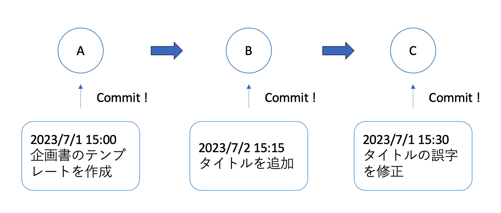
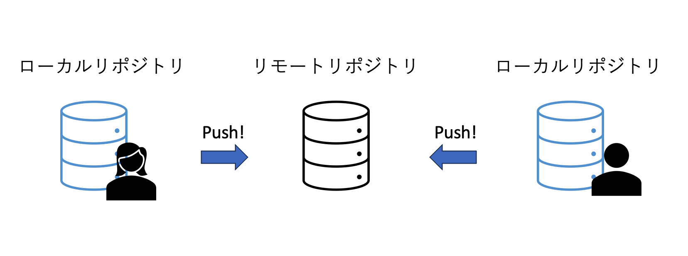
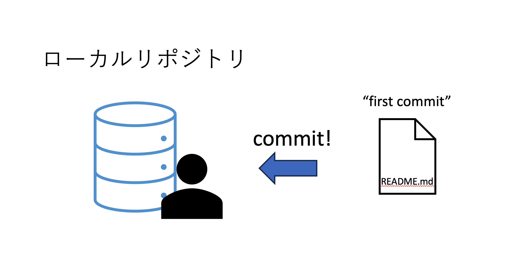
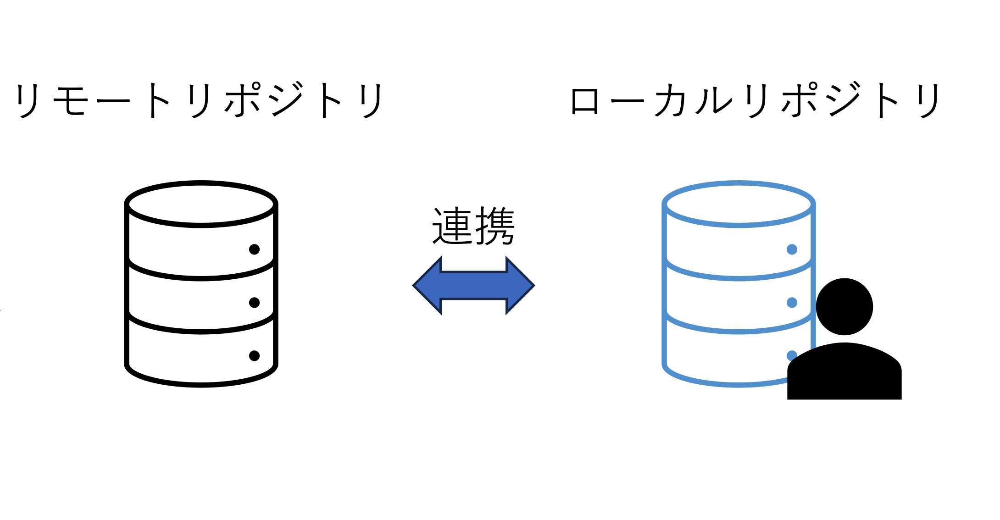
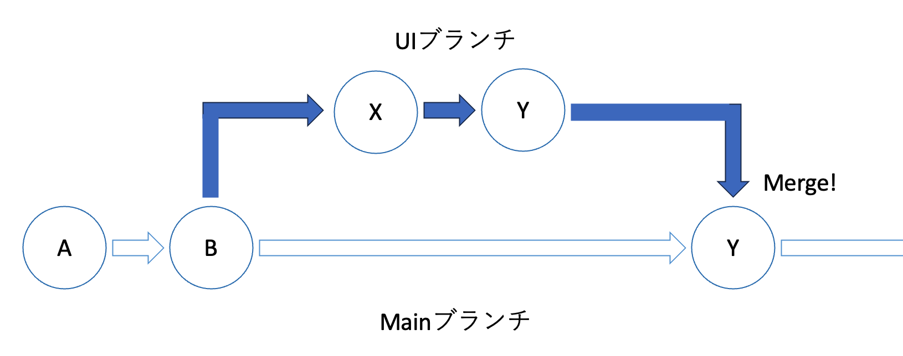
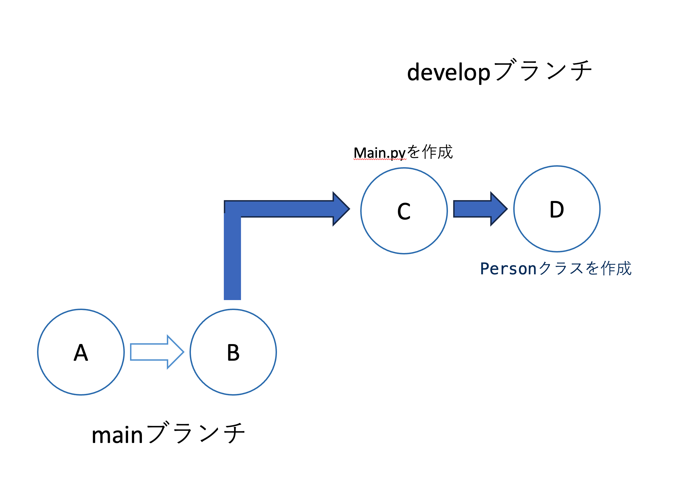
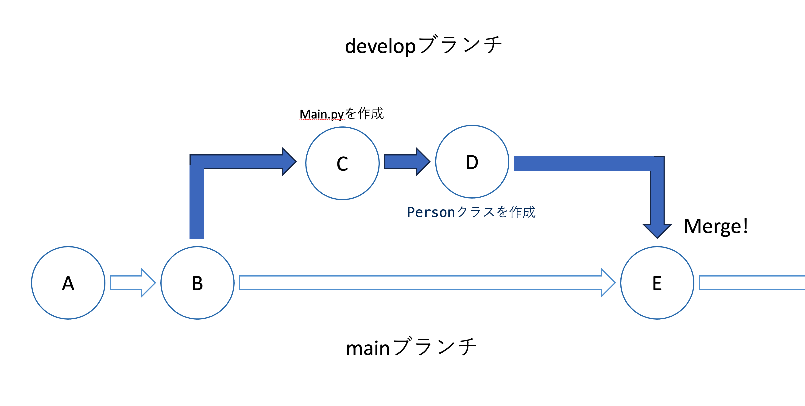
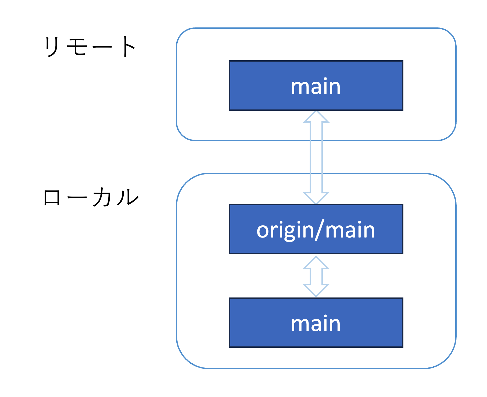

# Git入門

- [Git入門](#git入門)
  - [0. Gitのインストール](#0-gitのインストール)
    - [0.1 Windows](#01-windows)
    - [0.2 Mac](#02-mac)
    - [0.3 動作確認](#03-動作確認)
  - [1. Gitの概要](#1-gitの概要)
    - [1.1 Gitとは](#11-gitとは)
    - [1.2 GitとGitHubの違い](#12-gitとgithubの違い)
  - [2. Gitの基本](#2-gitの基本)
    - [2.1 リポジトリとは](#21-リポジトリとは)
    - [2.2 コミットとは](#22-コミットとは)
    - [2.3 ワークツリーとインデックス](#23-ワークツリーとインデックス)
      - [ワークツリーとは](#ワークツリーとは)
      - [インデックスとは](#インデックスとは)
    - [2.4 リポジトリの共有](#24-リポジトリの共有)
  - [3. ハンズオン  -基礎](#3-ハンズオン---基礎)
    - [3.1 リモートリポジトリの作成](#31-リモートリポジトリの作成)
    - [3.2 ローカルリポジトリの作成](#32-ローカルリポジトリの作成)
    - [3.3 コミット](#33-コミット)
    - [3.4 ローカルとリモートの連携](#34-ローカルとリモートの連携)
    - [3.5 プッシュ](#35-プッシュ)
  - [4. ハンズオン -ブランチ](#4-ハンズオン--ブランチ)
    - [4.1 ブランチとは](#41-ブランチとは)
    - [4.2 ブランチの作成](#42-ブランチの作成)
    - [4.3 作業](#43-作業)
    - [4.4 プルリクエスト](#44-プルリクエスト)
    - [4.5 マージ](#45-マージ)
  - [5. ハンズオン -プル](#5-ハンズオン--プル)
    - [5.1 プルとは](#51-プルとは)
      - [origin/mainについて](#originmainについて)
    - [5.2 リモートの変更](#52-リモートの変更)
    - [5.3 フェッチ](#53-フェッチ)
    - [5.4 マージ](#54-マージ)
    - [5.5 プル](#55-プル)
  - [6. その他](#6-その他)
    - [6.1 Markdown](#61-markdown)
    - [6.2 Issue](#62-issue)
    - [6.3 Wiki](#63-wiki)
    - [6.4　コミットの粒度](#64コミットの粒度)
    - [6.5 ミクシイの資料](#65-ミクシイの資料)
    - [6.7 最後に](#67-最後に)


## 0. Gitのインストール

### 0.1 Windows

Powershellで以下のコマンドを実行。

```sh
$ winget install Git
```

### 0.2 Mac

デフォルトでインストールされているはず。

### 0.3 動作確認

以下のコマンドで動作確認。成功すればバージョンが返ってくる。

```sh
$ git -v
```

## 1. Gitの概要

### 1.1 Gitとは

- バージョン管理ツール
- 「企画書_第一版.pdf」とか、「企画書_初版.pdf」とか、わかりにくい！
- これを解決する。容量も抑えられる。
- チーム開発にも向いている。
  
### 1.2 GitとGitHubの違い

- GitHubは、Gitを利用した、開発者を支援するWebサービス。
- ソースコードがweb上でみれたり、issue(todoみたいなやつ)が作れたりする。

## 2. Gitの基本

### 2.1 リポジトリとは

- リポジトリとは、ファイルやディレクトリの状態を記録する場所の事
- 登録する度に作業内容のファイルやディレクトリなどの変更履歴が格納される
- プロジェクトを行うフォルダと思って大丈夫。

### 2.2 コミットとは

- ファイルやディレクトリの追加変更をリポジトリに記録する操作の事。コミットは全て履歴が残るので、遡ることができる。
- コミットメッセージには、変更内容を明示する。


図1: コミット

### 2.3 ワークツリーとインデックス

#### ワークツリーとは

- 作業しているディレクトリの事。

#### インデックスとは

- リポジトリにコミットする準備をするための領域。
- インデックスに追加(ステージ)してからコミットする。

例えば、企画書だったら、タイトルと目的を追加したけど、別々に履歴を残したい時、
1. タイトルの変更をステージ
2. コミット(コミットメッセージは「タイトルを追加」)
3. 目的の変更をステージ
4. コミット(コミットメッセージは「目的を追加」)

とする。

### 2.4 リポジトリの共有

- ローカルリポジトリとリモートリポジトリがある。
- リモートリポジトリはチームメンバーが共有している。

- ローカルリポジトリにコミットしたもの(自分が作業した分)をリモートに反映させることをpushという。


図2: プッシュ

## 3. ハンズオン  -基礎

### 3.1 リモートリポジトリの作成

githubでリモーリポジトリを作成。

### 3.2 ローカルリポジトリの作成

```sh
$ mkdir git-tutorial
$ git init
```

### 3.3 コミット

1. README.mdを作成
2. Hello World!と記入
3. ステージする
```sh
$ git add README.md
```
4. コミットする
```sh
$ git commit -m "first commit"
```



### 3.4 ローカルとリモートの連携

1. おまじない(作業中のブランチの名前をmainに変更)
```sh
$ git branch -M main
```
2. originという名前でリモートを登録
```sh
$ git remote add origin https://github.com/<your name>/<repository name>.git
```



### 3.5 プッシュ

1. ローカルの変更分をリモートに反映させる
```sh
$ git push -u origin main
```

2. githubを確認してみる(README.mdが更新されて、mainができている)

## 4. ハンズオン -ブランチ

### 4.1 ブランチとは

- ブランチとは履歴の流れを分岐して記録していくためのもの。
- 他のブランチの影響を受けないため、同じリポジトリの中で複数の変更を同時に進行できる。
- 例) uiを作成するブランチ、apiを作成するブランチ など
- 分岐したブランチは、マージすることで統合できる。
- uiの実装が終わった後に、mainにマージする。(マージする前にプルリクエストを送信して、コードをレビューしてもらう。)


図3: ブランチ

### 4.2 ブランチの作成

1. 現在のブランチ一覧を確認
```sh
$ git branch
```
2. developブランチを作成
```sh
$ git branch develop
```
3. 現在のブランチ一覧を確認
```sh
$ git branch
```
4. ブランチを移動
```sh
$ git checkout develop
```
5. 現在のブランチ一覧を確認
```sh
$ git branch
```
6. リモートに登録
```sh
$ git push -u origin develop
```

### 4.3 作業

1. main.pyを作成して以下のコードを記述する。
```python
import person

if __name__ == "__main__":
    shuya = person.Person(name="shuya")
    shuya.greeting()
```
2. ステージしてコミットする
```sh
$ git add main.py
$ git commit -m "main.pyを作成"
```
3. person.pyを作成して以下のコードを記述する
```python
class Person():
    def __init__(self, name):
        self.name = name

    def greeting(self):
        print(f"my name is{self.name}")
```
4. ステージしてコミットする
```sh
$ git add person.py
$ git commit -m "Personクラスを作成"
```



### 4.4 プルリクエスト

1. リモートにpushする
```sh
$ git push
```
2. githubからプルリクエストを作成する

### 4.5 マージ

1. レビューする。
2. マージする。



## 5. ハンズオン -プル

### 5.1 プルとは

リモートの変更分を現在のワークツリーに反映させたい！

#### origin/mainについて
- 実は、リモートと接続した時、リモートにmainブランチができると同時に、ローカルにはorigin/mainが作成される。
- リモートのmainとローカルのmainを繋げる役割がある
- リモートのmainブランチ→ローカルのorigin/main→ローカルのmain


図4: origin/main

### 5.2 リモートの変更

1. 誰かがリモートを変更したことを想定して、README.mdをgithubで書き換える

### 5.3 フェッチ

1. 現在のブランチを確認
```sh
$ git branch
```
2. ブランチをmainに変更
```sh
$ git checkout main
```
3. リモートのmainを、ローカルのorigin/mainに反映させる
```sh
$ git fetch origin main
```

### 5.4 マージ
1. ローカルのorigin/mainをローカルのmainに反映させる。
```sh
$ git branch // <-念のため現在のブランチを確認
$ git merge origin/main
```

### 5.5 プル

フェッチをマージを同時に行うのがプル
```sh
$ git pull origin main
```

## 6. その他

### 6.1 Markdown

書き方絶対覚えて！

### 6.2 Issue

- todoみたいなやつ
- 例を見せる

### 6.3 Wiki

ドキュメントを管理する場所

### 6.4　コミットの粒度

- 関数単位
- 機能単位
- //TODO:
- 一息ついたらコミット！

### 6.5 ミクシイの資料

- Gitの内部構造
- コンフリクトの解消方法
https://mixi-developers.mixi.co.jp/23-technical-training-20a6f610140c

### 6.7 最後に

- 今回は入門
- これだけでは不十分
- ミクシイの資料とかで勉強して！